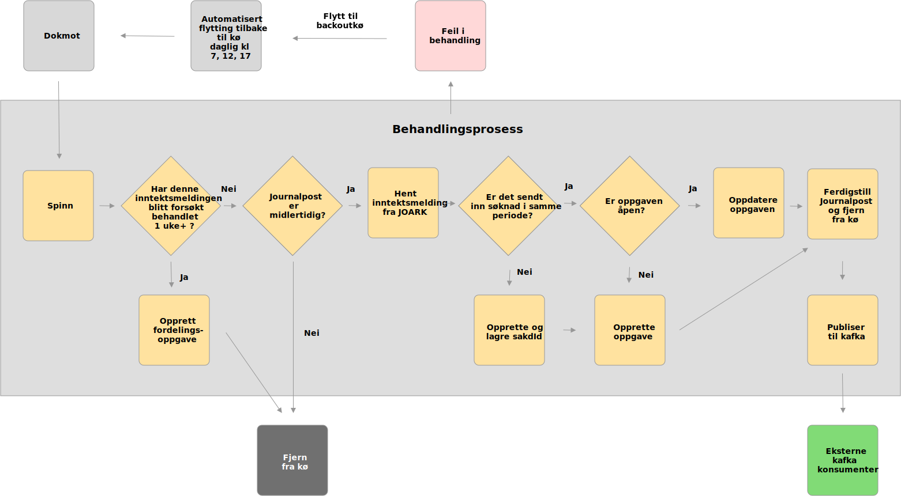

# Syfoinntektsmelding

## Funksjonalitet
Oppgaven til syfoinntektsmelding er å lytte på en kø med nye inntektsmeldinger. Når den finner en ny inntektsmelding skal appen opprette eller oppdatere en oppgave i GOSYS for så å ferdigstille en journalpost med oppdatert informasjon.

## Diagram

## For å starte appen lokalt:
Applikasjonen startes i LocalApplication.class Den må kjøre som en spring-boot applikasjon med local som profil. 
Du må også ha en `application-local.properties` som peker på eksterne avhenigheter. Denne fås av en annen utvikler.
