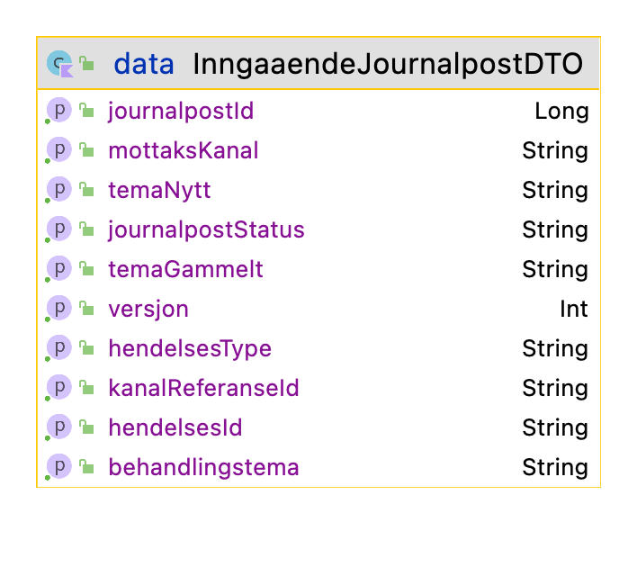
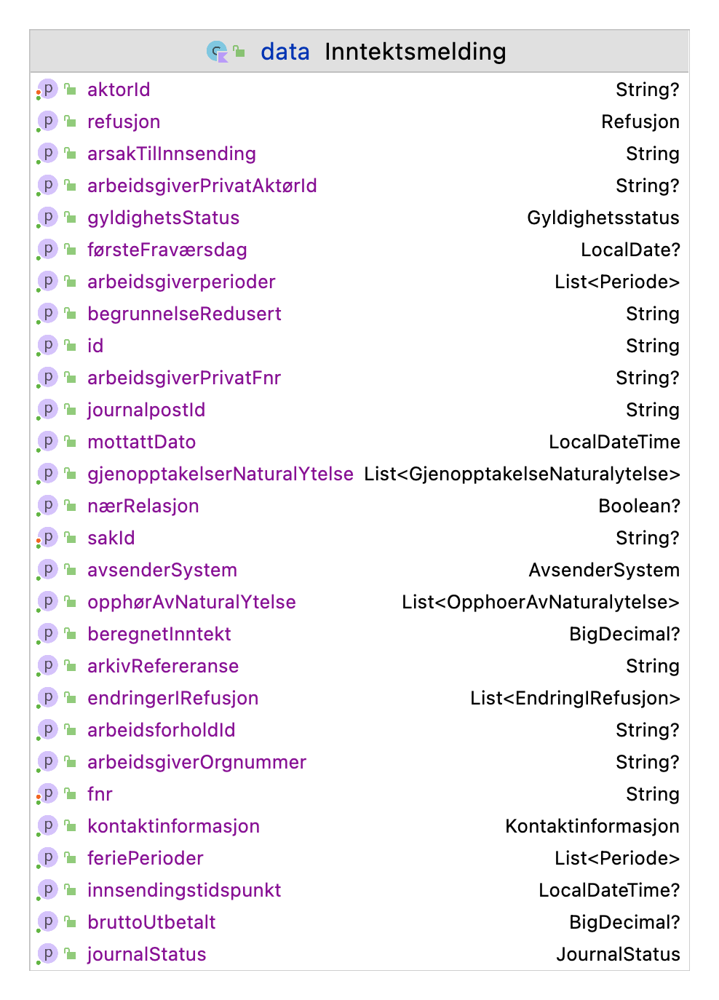

# Syfoinntektsmelding

  
 
 

 

## Formål
Applikasjonen tar imot innkommende inntektsmeldinger for sykepenger, journalfører dette og oppretter oppgaver i
Gosys for behandlende enhet. Dersom behandlede enhet ikke er funnet blir det opprettet en fordelingsoppgave istedet.
Andre applikasjoner kan be om utsettelse eller ignorering av opprettelser av disse oppgavene.

### Oversikt

## Meldingsinnhold om JoarkHendelse
Illustrasjonen viser innholdet i kafka meldingen (InngaaendeJournalpostDTO).

## Detaljer om inntektsmelding
Illustrasjonen viser inntektsmeldingen i sin helhet

## Robusthet
Applikasjonen er laget med tanke på aldri miste noen inntektsmeldinger. Dette er løst med disse tiltakene:

### Melding om ny inntekstmelding
[JoarkHendelseConsumer](/src/main/kotlin/no/nav/syfo/kafkamottak/JoarkHendelseConsumer) lytter på en 
Kafka kø. Straks den får nyss om inntektsmelding blir kafka-meldingen lagret i databasen og køet opp til behandling av de
periodiserte jobbene.

### Periodiserte jobber (køer)
[BakgrunnsjobbService](/src/main/kotlin/no/nav/syfo/bakgrunnsjobb/BakgrunnsjobbService) kjører to ulike jobber med faste
tidsintervaller. Hver av de henter ventende oppgaver fra køen (databasen). Oppgaver som feiler sendes tilbake til køen 
med en utsettelse. Dersom de feiler for mange ganger blir de stoppet.

#### Behandling
[JoarkInntektsmeldingHendelseProsessor](/src/main/kotlin/no/nav/syfo/kafkamottak/JoarkInntektsmeldingHendelseProsessor) henter 
ut inntektsmelding fra køen og sjekker hvor lenge den har ligget ubehandlet i køen. Dersom tidsfristen er nådd opprettes
det en fordelingsoppgave i Gosys og inntektsmeldingen blir markert som ferdigbehandlet og tatt ut av køen. Hvis ikke
ferdigstilles journalposten for inntektsmeldingen det gjelder og fjernes fra denne køen. I tillegg blir det opprettet 
en jobb i oppgavekøen under. Til slutt blir inntektsmeldingen lagt på en Kafka topic. 

#### Oppgave
[FeiletUtsattOppgaveMeldingProsessor](/src/main/kotlin/no/nav/syfo/utsattoppgave/FeiletUtsattOppgaveMeldingProsessor) henter 
ut oppgaver fra køen og sjekker tilstanden. Dersom tilstanden er satt i å opprette blir det opprettet en Gosys-oppgave.

## Varsling om oppgave status
[UtsattOppgaveConsumer](/src/main/kotlin/no/nav/syfo/utsattoppgave/UtsattOppgaveConsumer) lytter på en Kafka kø om det
er oppgaver som skal forkastes eller utsettes. Oppgaver som blir funnet her endrer tilstanden
i køen for Oppgave i avsnittet over.

## Utvikling

### Kjøre applikasjonen lokalt
Applikasjonen er avhengig av mange tjenester og det enkleste er å starte den inne fra en 
tynnklient hvor tjenestene er 
tilgjengelige. 

Applikasjonen må kjøres som en spring-boot applikasjon med local som profil. For å kunne starte 
så MÅ du sette tre 
environment variabler ellers vil den ikke starte. Det er filen `application-local.properties` 
som bestemmer hvilke tjenster som blir benytter lokalt. For å kunne kjøre må du påse at alle
disse miljø innstillingene er riktig og fylle ut innstillinger for passord da de nå er satt 
til dummy.

### Ktlint

Prosjektet bruker en [Ktlint](https://ktlint.github.io/)-plugin for Gradle som håndhever kodestilregler. Nyttige kommandoer er:

- `gradle lintKotlin` (sier ifra om brudd på kodestilreglene)
- `gradle formatKotlin` (retter opp i brudd på kodestilreglene)

Det anbefales hver utvikler å konfigurere en pre-commit hook som automatisk sjekker endrede filer for brudd på kodestilreglene.
Alternativt kan man sette opp automatisk formattering. Kommandoene for dette er:

- `gradle installKotlinterPrePushHook` (automatisk formattering)

Les mer om pluginen [her](https://github.com/jeremymailen/kotlinter-gradle).

## Database
Applikasjonen bruker Postgres database med JPA grensesnitt OG et JDBC grensesnitt. Skjermbildet nedenfor viser samtlige 
tabeller som er brukt.
Flyway blir brukt til versjonering i databasen.

## For NAV-ansatte
Interne henvendelser kan sendes via Slack i kanalen #helse-arbeidsgiver
